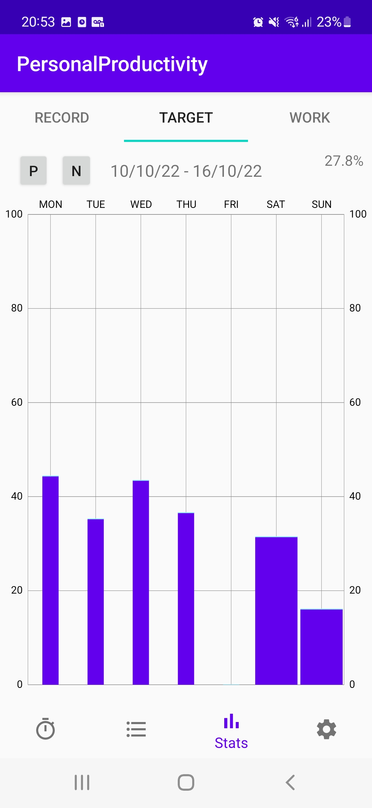
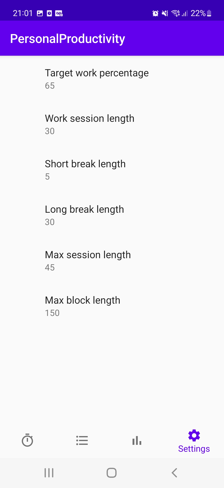

# Personal Productivity

This is a productivity app, containing a pomodoro-technique based timer as well as a to-do list. It has been designed 
for personal use and as such is highly opinionated, such as only allowing the user to do tasks that the app believes 
they should be doing.

## The work timer
The app works by automatically scheduling when the user should be working.

If the user is not currently working, then
this is considered a "Break" and the timer shows the time until the next work session.

In order to make sure the user follows a schedule, they may not start a session after the scheduled time.
To prevent them from simply starting the next session if they miss a session, they may only start
a session up to 5 minutes before the scheduled start time.

    
    

The user can also select the task they are working on (and this can be changed while the timer is running). They can
also use the tick to mark it as done and start another task.

## Hierarchical task list

The task list contains a hierarchy, with projects on the top level, with each project containing task groups and 
each task group containing tasks. The respective screenshots are shown below:

    
    
    

As you can see, each item has a completion status (to-do, in progress, done or failed). For projects and task groups, the 
total time they have been worked on is also shown. For tasks, the time they were worked on is shown, as well
as the expected time (which can be more or less), how much longer it should be worked on for today (in the top right) 
and the priority (bottom middle).

Pressing the "+" buttons creates a new item within the current list (e.g. a task group for the selected project).

Pressing it for a project or task group:

Pressing it for a task:

The task has a priority (from guaranteed to expected to unlikely, representing the probability that the task will be
done). Expected time and days until a deadline are also entered and are used to calculate how long the task
should be worked on today.

## Statistics

This contains 3 tabs with different statistics. They are displayed using MPAndroidChart

### Record

This shows the time each project was worked on on each day of the week. The top right shows the total time for the week.

    
    

### Target

The height of each bar shows the proportion of their free time that the user spent working on each day of the week.
The width of each bar represents the amount of free time the user had on that day. The top right also contains the
total percentage for the week

    
    

### Work

This shows the task records for each day i.e. what time each task was worked on and for how long. Long clicking a record
allows the task worked on to be modified.

    
    

## Settings

These allow the behaviour of the app to be customised.

Modifying the settings:

